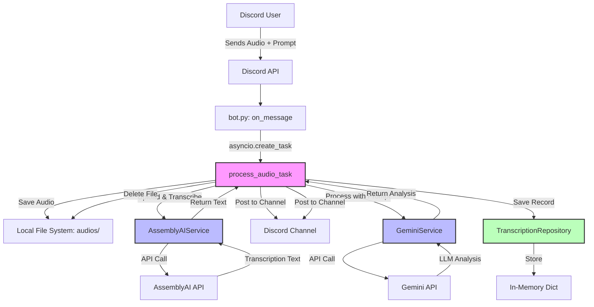

# Component Architecture

## New Components

### 1. AssemblyAIService

**Responsibility:** Encapsulate all interactions with AssemblyAI transcription API

**Integration Points:**
- Called by `process_audio_task()` async function
- Receives local audio file path
- Returns transcription text or raises exception on failure

**Key Interfaces:**
- `async def transcribe_audio(file_path: str) -> str`
  - Uploads audio file to AssemblyAI
  - Awaits transcription completion (stream-based, per user edit)
  - Returns full transcription text
- `async def get_transcription_status(transcription_id: str) -> dict`
  - Polls transcription status (if needed for non-stream approach)

**Dependencies:**
- **Existing Components:** None
- **New Components:** None (standalone service)
- **External:** AssemblyAI Python SDK

**Technology Stack:** Python, AssemblyAI SDK, asyncio

---

### 2. GeminiService

**Responsibility:** Handle all LLM processing using Google Gemini API

**Integration Points:**
- Called by `process_audio_task()` after transcription completes
- Receives transcription text + user prompt
- Returns LLM-processed analysis

**Key Interfaces:**
- `async def process_with_llm(transcription: str, user_prompt: str) -> str`
  - Constructs prompt: user_prompt + transcription
  - Sends to Gemini API
  - Returns formatted analysis result

**Dependencies:**
- **Existing Components:** None
- **New Components:** None (standalone service)
- **External:** Google Generative AI SDK

**Technology Stack:** Python, google-generativeai SDK, asyncio

---

### 3. TranscriptionRepository (Interface + Mock Implementation)

**Responsibility:** Provide data persistence abstraction for transcription records

**Integration Points:**
- Called by `process_audio_task()` to save completed transcriptions
- Enables future database migration without changing business logic

**Key Interfaces:**
- `async def save(transcription: Transcription) -> None`
  - Stores transcription record
- `async def get_by_id(job_id: str) -> Optional[Transcription]`
  - Retrieves transcription by job ID
- `async def get_by_user(user_id: int) -> List[Transcription]`
  - Retrieves all transcriptions for a user

**Dependencies:**
- **Existing Components:** None
- **New Components:** Uses Transcription data model
- **External:** None (in-memory dict for Phase 2)

**Technology Stack:**
- Python typing.Protocol for interface
- InMemoryTranscriptionRepository with dict storage

---

### 4. Async Processing Pipeline

**Responsibility:** Orchestrate async transcription and LLM processing without blocking Discord event loop

**Integration Points:**
- Triggered from `on_message()` event handler via `asyncio.create_task()`
- Coordinates AssemblyAIService, GeminiService, Repository
- Posts results to Discord channel

**Key Interfaces:**
- `async def process_audio_task(message: discord.Message, attachment: discord.Attachment, user_prompt: str) -> None`
  - Main orchestration function
  - Handles file download, transcription, LLM processing, Discord posting, cleanup

**Dependencies:**
- **Existing Components:** Discord client (for posting messages)
- **New Components:** AssemblyAIService, GeminiService, TranscriptionRepository
- **External:** asyncio, Discord API

**Technology Stack:** Python asyncio, discord.py

---

## Component Interaction Diagram

---
