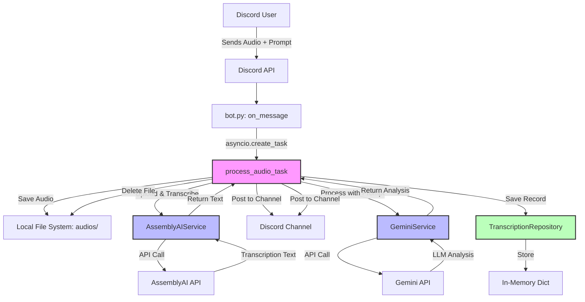

# Vox Discord Bot - Phase 2 Enhancement Architecture

**Architecture Document**
**Version**: 1.0
**Date**: 2025-10-18
**Type**: Brownfield Enhancement Architecture

---

## Introduction

This document outlines the architectural approach for enhancing Vox Discord Bot with intelligent audio transcription and LLM-powered analysis capabilities. Its primary goal is to serve as the guiding architectural blueprint for AI-driven development of new features while ensuring seamless integration with the existing system.

### Relationship to Existing Architecture

This document supplements the existing Vox bot architecture by defining how new components (AssemblyAI transcription, Gemini LLM processing, async pipeline, mock repository) will integrate with the current Discord message handling system. The architecture prioritizes non-breaking, additive changes that preserve the reliability of the existing bot while delivering substantial new value.

### Existing Project Analysis

#### Current Project State

- **Primary Purpose:** Discord bot for receiving and storing audio file attachments
- **Current Tech Stack:** Python 3.x, discord.py 2.6.4, aiohttp 3.13.1, python-dotenv
- **Architecture Style:** Event-driven (Discord message events), monolithic single-file bot
- **Deployment Method:** Server-based deployment (Phase 1 assumed operational)

#### Available Documentation

- Brownfield PRD (docs/prd/vox-phase2-prd.md) - Comprehensive requirements for Phase 2
- Minimal existing project documentation (to be created during implementation)
- Source code (bot.py, transcription.py) serves as primary documentation

#### Identified Constraints

- **Async Event Loop:** Must not block discord.py's event loop during long-running operations
- **File System:** Local storage in `audios/` directory with manual cleanup required
- **No Database:** Current system has no persistence layer
- **Single Server:** No distributed architecture; all processing on one server
- **Portuguese Language:** All user-facing messages must be in Portuguese
- **Free Tier APIs:** Must use AssemblyAI and Gemini free tiers to minimize costs

### Change Log

| Change | Date | Version | Description | Author |
|--------|------|---------|-------------|--------|
| Initial Architecture | 2025-10-18 | 1.0 | Created Phase 2 enhancement architecture based on PRD and codebase analysis | Architect Agent |

---

## Enhancement Scope and Integration Strategy

### Enhancement Overview

**Enhancement Type:** New Feature Addition + External API Integration
**Scope:** Add transcription (AssemblyAI) and LLM analysis (Gemini) to existing audio file handling
**Integration Impact:** Moderate - extends existing message handler, adds new service layer and async pipeline

### Integration Approach

**Code Integration Strategy:**
- **Additive Only:** No modifications to existing `on_ready()` or `!ping` functionality
- **Extend Message Handler:** Enhance `on_message()` to delegate audio processing to new async pipeline
- **Service Layer Pattern:** Introduce service classes (AssemblyAIService, GeminiService) following single responsibility principle
- **Dependency Injection:** Repository pattern allows future database swap without changing business logic

**Database Integration:**
- **Phase 2:** In-memory mock repository (`InMemoryTranscriptionRepository`)
- **Future:** Swap to PostgreSQL/MongoDB via repository interface
- **No Schema Migration:** Mock storage requires no database setup

**API Integration:**
- **External APIs:** AssemblyAI (transcription), Gemini (LLM processing)
- **Internal APIs:** N/A (Discord bot interface only)
- **Integration Method:** Dedicated service classes wrapping external SDKs

**UI Integration:**
- **Interface:** Discord messages only (no web UI)
- **Consistency:** Maintain existing emoji-based visual language (🎙️, 📝, 🤖, ⚠️)
- **Message Pattern:** Two-message output (transcription + LLM analysis)

### Compatibility Requirements

- **Existing API Compatibility:** Preserve all existing Discord message handling; `!ping` continues to work
- **Database Schema Compatibility:** N/A (no existing database)
- **UI/UX Consistency:** Maintain Portuguese language and emoji patterns from existing bot
- **Performance Impact:** Async processing ensures message handling latency remains < 2 seconds (NFR4)

---

## Tech Stack Alignment

### Existing Technology Stack

| Category | Current Technology | Version | Usage in Enhancement | Notes |
|----------|-------------------|---------|----------------------|-------|
| Language | Python | 3.x (3.8+) | All new code | Type hints mandatory for Phase 2 |
| Discord API Client | discord.py | 2.6.4 | Event handling integration | Existing async event loop |
| Async HTTP | aiohttp | 3.13.1 | Potentially for API calls | May be replaced by SDK clients |
| Config Management | python-dotenv | 1.1.1 | New API key storage | Add ASSEMBLYAI_API_KEY, GEMINI_API_KEY |
| Logging | Python logging | stdlib | Enhanced logging | Add structured logging with job IDs |

### New Technology Additions

| Technology | Version | Purpose | Rationale | Integration Method |
|-----------|---------|---------|-----------|-------------------|
| AssemblyAI Python SDK | Latest | Audio transcription | Official SDK for AssemblyAI API, handles streaming | Wrapper service class |
| Google Generative AI SDK | Latest (google-generativeai) | LLM processing with Gemini | Official Google SDK for Gemini, 1M token context | Wrapper service class |
| asyncio (stdlib) | 3.8+ | Async task management | Required for non-blocking long-duration processing | Direct usage in bot.py |

---

## Data Models and Schema Changes

### New Data Models

#### Transcription Model

**Purpose:** Represent a completed transcription job with LLM analysis results

**Integration:** Mock in-memory storage (Phase 2), future database persistence (Phase 3+)

**Key Attributes:**
- `job_id`: str (UUID) - Unique identifier for the transcription job
- `user_id`: int - Discord user ID who submitted the audio
- `filename`: str - Original audio filename
- `transcription_text`: str - Full transcription from AssemblyAI
- `user_prompt`: str - Custom LLM prompt provided by user
- `llm_result`: str - Analysis result from Gemini
- `timestamp`: datetime - Job creation time
- `status`: str (enum: pending, processing, completed, failed) - Job status

**Relationships:**
- **With Existing:** None (no existing data models)
- **With New:** Standalone model for Phase 2

### Schema Integration Strategy

**Database Changes Required:**
- **New Tables:** None (Phase 2 uses in-memory mock)
- **Modified Tables:** None
- **New Indexes:** None
- **Migration Strategy:** Future migration will create `transcriptions` table from repository interface

**Backward Compatibility:**
- Mock repository is purely additive; removal does not affect existing bot functionality
- No breaking changes to Discord message interface

---

## Component Architecture

### New Components

#### 1. AssemblyAIService

**Responsibility:** Encapsulate all interactions with AssemblyAI transcription API

**Integration Points:**
- Called by `process_audio_task()` async function
- Receives local audio file path
- Returns transcription text or raises exception on failure

**Key Interfaces:**
- `async def transcribe_audio(file_path: str) -> str`
  - Uploads audio file to AssemblyAI
  - Awaits transcription completion (stream-based, per user edit)
  - Returns full transcription text
- `async def get_transcription_status(transcription_id: str) -> dict`
  - Polls transcription status (if needed for non-stream approach)

**Dependencies:**
- **Existing Components:** None
- **New Components:** None (standalone service)
- **External:** AssemblyAI Python SDK

**Technology Stack:** Python, AssemblyAI SDK, asyncio

---

#### 2. GeminiService

**Responsibility:** Handle all LLM processing using Google Gemini API

**Integration Points:**
- Called by `process_audio_task()` after transcription completes
- Receives transcription text + user prompt
- Returns LLM-processed analysis

**Key Interfaces:**
- `async def process_with_llm(transcription: str, user_prompt: str) -> str`
  - Constructs prompt: user_prompt + transcription
  - Sends to Gemini API
  - Returns formatted analysis result

**Dependencies:**
- **Existing Components:** None
- **New Components:** None (standalone service)
- **External:** Google Generative AI SDK

**Technology Stack:** Python, google-generativeai SDK, asyncio

---

#### 3. TranscriptionRepository (Interface + Mock Implementation)

**Responsibility:** Provide data persistence abstraction for transcription records

**Integration Points:**
- Called by `process_audio_task()` to save completed transcriptions
- Enables future database migration without changing business logic

**Key Interfaces:**
- `async def save(transcription: Transcription) -> None`
  - Stores transcription record
- `async def get_by_id(job_id: str) -> Optional[Transcription]`
  - Retrieves transcription by job ID
- `async def get_by_user(user_id: int) -> List[Transcription]`
  - Retrieves all transcriptions for a user

**Dependencies:**
- **Existing Components:** None
- **New Components:** Uses Transcription data model
- **External:** None (in-memory dict for Phase 2)

**Technology Stack:**
- Python typing.Protocol for interface
- InMemoryTranscriptionRepository with dict storage

---

#### 4. Async Processing Pipeline

**Responsibility:** Orchestrate async transcription and LLM processing without blocking Discord event loop

**Integration Points:**
- Triggered from `on_message()` event handler via `asyncio.create_task()`
- Coordinates AssemblyAIService, GeminiService, Repository
- Posts results to Discord channel

**Key Interfaces:**
- `async def process_audio_task(message: discord.Message, attachment: discord.Attachment, user_prompt: str) -> None`
  - Main orchestration function
  - Handles file download, transcription, LLM processing, Discord posting, cleanup

**Dependencies:**
- **Existing Components:** Discord client (for posting messages)
- **New Components:** AssemblyAIService, GeminiService, TranscriptionRepository
- **External:** asyncio, Discord API

**Technology Stack:** Python asyncio, discord.py

---

### Component Interaction Diagram



---

## External API Integration

### AssemblyAI API

- **Purpose:** Professional-grade audio transcription for uploaded files
- **Documentation:** https://www.assemblyai.com/docs
- **Base URL:** https://api.assemblyai.com
- **Authentication:** Bearer token (API key in Authorization header)
- **Integration Method:** Python SDK wrapping REST API

**Key Endpoints Used:**
- `POST /v2/upload` - Upload audio file
- `POST /v2/transcript` - Create transcription job
- `GET /v2/transcript/{id}` - Poll transcription status (or use streaming)

**Error Handling:**
- Retry logic with exponential backoff (max 3 retries) for transient failures
- User-friendly Portuguese error messages on permanent failures
- Timeout: 10 minutes for long audio files

---

### Gemini API

- **Purpose:** LLM-powered analysis of transcriptions with custom user prompts
- **Documentation:** https://ai.google.dev/docs
- **Base URL:** Via google-generativeai SDK
- **Authentication:** API key configuration via SDK
- **Integration Method:** Official Python SDK

**Key Endpoints Used:**
- `generateContent` - Send prompt + transcription, receive analysis

**Error Handling:**
- Retry logic with exponential backoff (max 3 retries)
- Handle token limit errors (1M context window should be sufficient for 2-hour audio)
- Graceful failure: if LLM fails, transcription still posted to Discord

---

## Source Tree Integration

### Existing Project Structure

```
vox/
├── bot.py                    # Main Discord bot (67 lines)
├── transcription.py          # Placeholder transcription (12 lines)
├── requirements.txt          # Python dependencies
├── .env                      # Environment variables (not committed)
├── .gitignore
├── readme.md
└── audios/                   # Local audio storage (created at runtime)
```

### New File Organization

```
vox/
├── bot.py                         # Main Discord bot (MODIFIED: extended on_message)
├── transcription.py               # REMOVED: replaced by services/
├── requirements.txt               # UPDATED: add assemblyai, google-generativeai
├── .env                           # UPDATED: add ASSEMBLYAI_API_KEY, GEMINI_API_KEY
├── .gitignore                     # UPDATED: ensure audios/ ignored
├── readme.md                      # UPDATED: Phase 2 setup instructions
├── audios/                        # Existing local storage (temporary files)
├── services/                      # NEW: Service layer
│   ├── __init__.py
│   ├── assemblyai_service.py    # AssemblyAI integration
│   └── gemini_service.py         # Gemini LLM integration
├── repositories/                  # NEW: Data layer (mock)
│   ├── __init__.py
│   ├── transcription_repo.py    # Repository interface + InMemoryTranscriptionRepository
│   └── models.py                 # Transcription data model
├── utils/                         # NEW: Utilities
│   ├── __init__.py
│   └── async_helpers.py          # Async pipeline helpers (if needed)
└── tests/                         # NEW: Test suite
    ├── __init__.py
    ├── test_assemblyai_service.py
    ├── test_gemini_service.py
    ├── test_repository.py
    └── test_integration.py        # End-to-end tests with mocked APIs
```

### Integration Guidelines

- **File Naming:** `snake_case` for all Python files (PEP 8)
- **Folder Organization:** Service layer pattern (services/, repositories/, utils/, tests/)
- **Import/Export Patterns:**
  - Services and repositories export public classes via `__init__.py`
  - Bot.py imports from services and repositories
  - Circular imports prevented via dependency injection

---

## Infrastructure and Deployment Integration

### Existing Infrastructure

**Current Deployment:** Server-based deployment (Phase 1 operational)
**Infrastructure Tools:** Manual deployment (no CI/CD defined in Phase 1)
**Environments:** Single production environment

### Enhancement Deployment Strategy

**Deployment Approach:**
- Same server as Phase 1
- Requires network access to AssemblyAI and Gemini APIs (HTTPS outbound)
- No additional infrastructure (databases, load balancers, etc.)

**Infrastructure Changes:**
- Environment variables: Add `ASSEMBLYAI_API_KEY`, `GEMINI_API_KEY`, optional `GEMINI_MODEL`
- Dependencies: Update `requirements.txt` and run `pip install -r requirements.txt`
- Disk space: Monitor `audios/` directory (cleanup logic ensures minimal usage deleting audio after usage)

**Pipeline Integration:**
- Manual deployment recommended for Phase 2 (same as Phase 1)
- Future: Add GitHub Actions for automated testing (optional post-MVP)

### Rollback Strategy

**Rollback Method:**
1. **Immediate Rollback:** Stop bot process, revert code to Phase 1 version, restart
2. **Feature Flag (Recommended):** Add `ENABLE_PHASE2_FEATURES=true/false` environment variable
   - If false, skip all Phase 2 processing and behave as Phase 1
   - Allows instant disable without code deployment

**Risk Mitigation:**
- Comprehensive logging (job IDs, timestamps, error messages) for debugging
- Async error handling prevents bot crashes from cascading failures
- Startup validation ensures API keys configured before processing jobs

**Monitoring:**
- Log file monitoring for error patterns
- Discord channel monitoring for user complaints
- Server resource monitoring (CPU, memory, disk) for performance degradation

**Rollback Triggers:**
- Bot unresponsive to `!ping` for > 1 minute
- Error rate > 50% for transcription jobs
- Server resource exhaustion (CPU > 90% sustained, memory > 80%)
- User reports of broken existing functionality

---

## Coding Standards and Conventions

### Existing Standards Compliance

**Code Style:** PEP 8 (Python Enhancement Proposal 8)
**Linting Rules:** None currently enforced (recommend adding `pylint` or `black` for Phase 2)
**Testing Patterns:** No existing tests (Phase 2 introduces pytest)
**Documentation Style:** Minimal inline comments; Phase 2 requires Google-style docstrings

### Enhancement-Specific Standards

- **Type Hints:** Mandatory for all function signatures in new code
  ```python
  async def transcribe_audio(file_path: str) -> str:
      """Transcribe audio file using AssemblyAI."""
  ```
- **Async/Await:** All I/O-bound operations must use `async`/`await` to prevent blocking
- **Error Handling:** Explicit try-except with specific exceptions; never bare `except:`
- **Logging:** Structured logging with job IDs for traceability
  ```python
  logger.info(f"[{job_id}] Transcription started for {filename}")
  ```
- **Docstrings:** Google-style docstrings for all public functions
  ```python
  async def process_audio_task(message: discord.Message, attachment: discord.Attachment, user_prompt: str) -> None:
      """Process audio file with transcription and LLM analysis.

      Args:
          message: Discord message containing the audio attachment
          attachment: Audio file attachment object
          user_prompt: User's custom prompt for LLM analysis

      Returns:
          None (posts results to Discord channel)

      Raises:
          AssemblyAIError: If transcription fails after retries
          GeminiError: If LLM processing fails after retries
      """
  ```

### Critical Integration Rules

- **Existing API Compatibility:** Never modify `on_ready()` or `!ping` handler; only extend `on_message()`
- **Database Integration:** Always use TranscriptionRepository interface, never direct database calls
- **Error Handling:** Graceful degradation - if LLM fails, still post transcription; if transcription fails, post clear error
- **Logging Consistency:** Use existing `logging` module with INFO level; add DEBUG for development

---

## Testing Strategy

### Integration with Existing Tests

**Existing Test Framework:** None (Phase 2 introduces pytest)
**Test Organization:** `tests/` directory with test files matching source structure
**Coverage Requirements:** Target 80% code coverage for new code (services, repository)

### New Testing Requirements

#### Unit Tests for New Components

- **Framework:** pytest (async support via pytest-asyncio)
- **Location:** `tests/test_assemblyai_service.py`, `tests/test_gemini_service.py`, `tests/test_repository.py`
- **Coverage Target:** 80% for service layer and repository
- **Integration with Existing:** N/A (no existing tests)

**Test Examples:**
```python
@pytest.mark.asyncio
async def test_assemblyai_service_transcribe_success(mock_assemblyai_api):
    """Test successful transcription with mocked AssemblyAI API."""
    service = AssemblyAIService(api_key="test_key")
    result = await service.transcribe_audio("test.mp3")
    assert result == "Expected transcription text"

@pytest.mark.asyncio
async def test_gemini_service_handles_api_failure():
    """Test graceful handling of Gemini API failure."""
    service = GeminiService(api_key="test_key")
    with pytest.raises(GeminiError):
        await service.process_with_llm("text", "prompt")
```

#### Integration Tests

- **Scope:** End-to-end flow from Discord message to posted results (with mocked APIs)
- **Existing System Verification:** Test that `!ping` continues to work after Phase 2 changes
- **New Feature Testing:** Test full audio processing pipeline with mocked AssemblyAI and Gemini

**Example:**
```python
@pytest.mark.asyncio
async def test_full_audio_processing_pipeline(mock_discord_client, mock_assemblyai, mock_gemini):
    """Test complete flow: audio upload → transcription → LLM → Discord post."""
    # Simulate Discord message with audio attachment
    # Verify transcription message posted
    # Verify LLM analysis message posted
    # Verify file cleanup
```

#### Regression Testing

- **Existing Feature Verification:** Automated tests for `!ping` command and basic message handling
- **Automated Regression Suite:** Run on every code change
- **Manual Testing Requirements:** Test with real Discord bot in test channel before production deployment

---

## Security Integration

### Existing Security Measures

**Authentication:** Discord bot token (DISCORD_TOKEN in .env)
**Authorization:** Bot permissions managed via Discord Developer Portal
**Data Protection:** Audio files stored locally with manual cleanup
**Security Tools:** None currently (python-dotenv for secret management)

### Enhancement Security Requirements

**New Security Measures:**
- API keys for AssemblyAI and Gemini stored in `.env` file (never committed to Git)
- Startup validation checks for required secrets
- Input validation: Verify audio file types before processing

**Integration Points:**
- `.gitignore` updated to ensure `.env` never committed
- API keys passed to services via dependency injection (not global variables)

**Compliance Requirements:**
- GDPR consideration: Audio files deleted after processing (no long-term storage in Phase 2)
- User data (transcriptions) stored in-memory only (Phase 2 mock repository)

### Security Testing

**Existing Security Tests:** None
**New Security Test Requirements:**
- Test that API keys are not logged or exposed in error messages
- Verify `.env` not included in repository
- Validate file type checking prevents malicious uploads

**Penetration Testing:** Not required for Phase 2 (Discord bot for internal/trusted users)

---

## Next Steps

### Story Manager Handoff

**Prompt for Story Manager:**

> Based on the Vox Phase 2 Brownfield Architecture (docs/architecture/vox-phase2-architecture.md) and PRD (docs/prd/vox-phase2-prd.md), create detailed implementation stories following the epic structure defined in the PRD.
>
> **Key Integration Requirements:**
> - All changes must preserve existing `!ping` functionality
> - Async processing pipeline must not block Discord message handling
> - Follow service layer pattern (services/, repositories/)
> - Use dependency injection for repository (enables future database swap)
>
> **Existing System Constraints:**
> - Python 3.8+, discord.py 2.6.4 async event loop
> - No database in Phase 1 (use mock repository)
> - Portuguese language for all user messages
> - Server deployment (no containerization required)
>
> **First Story to Implement:**
> Story 1.1: AssemblyAI Transcription Integration
> - Create `services/assemblyai_service.py` with `transcribe_audio()` method
> - Extend `on_message()` in bot.py to call service asynchronously
> - Add error handling and Portuguese user feedback
> - **Integration Checkpoint:** Verify `!ping` still responds during transcription processing
>
> **Emphasis:** Maintain existing system integrity throughout. Each story must include Integration Verification steps that test existing bot functionality.

### Developer Handoff

**Prompt for Developers:**

> You are implementing Phase 2 enhancements for the Vox Discord Bot. Reference the architecture document (docs/architecture/vox-phase2-architecture.md) for technical decisions and integration patterns.
>
> **Coding Standards (from actual project analysis):**
> - Python PEP 8 style: `snake_case` for functions/variables, `PascalCase` for classes
> - Type hints mandatory for all function signatures
> - Google-style docstrings for all public functions
> - Async/await for all I/O operations (never block discord.py event loop)
> - Logging with job IDs: `logger.info(f"[{job_id}] Message")`
>
> **Integration Requirements (validated with existing codebase):**
> - Extend `on_message()` in bot.py, never modify `on_ready()` or `!ping` handler
> - Use `asyncio.create_task()` for background processing
> - Always use `TranscriptionRepository` interface for data persistence
> - Maintain Portuguese language in all user-facing messages
> - Follow emoji patterns: 🎙️ (processing), 📝 (transcription), 🤖 (LLM), ⚠️ (error)
>
> **Key Technical Decisions:**
> - Service layer pattern: `services/assemblyai_service.py`, `services/gemini_service.py`
> - Repository pattern: `repositories/transcription_repo.py` with interface + mock implementation
> - Async pipeline: `process_audio_task()` orchestrates transcription → LLM → Discord post → cleanup
> - Error handling: Retry with exponential backoff (max 3), graceful degradation (post transcription even if LLM fails)
>
> **Compatibility Requirements (specific verification steps):**
> - After implementing each story, test `!ping` command responds within 2 seconds
> - Verify concurrent audio uploads don't block message handling
> - Check that existing audio file handling (saving to `audios/`) still works
> - Validate startup with missing API keys fails gracefully with clear error message
>
> **Clear Sequencing:**
> 1. Story 1.1: AssemblyAI integration (transcription only)
> 2. Story 1.2: Gemini integration (LLM processing)
> 3. Story 1.3: Async pipeline (concurrency, semaphore limiting)
> 4. Story 1.4: Repository (mock persistence, file cleanup)
> 5. Story 1.5: Error handling, logging, documentation
>
> This sequence minimizes risk: each story builds on the previous, with integration checkpoints ensuring existing functionality never breaks.

---

**End of Architecture Document**
